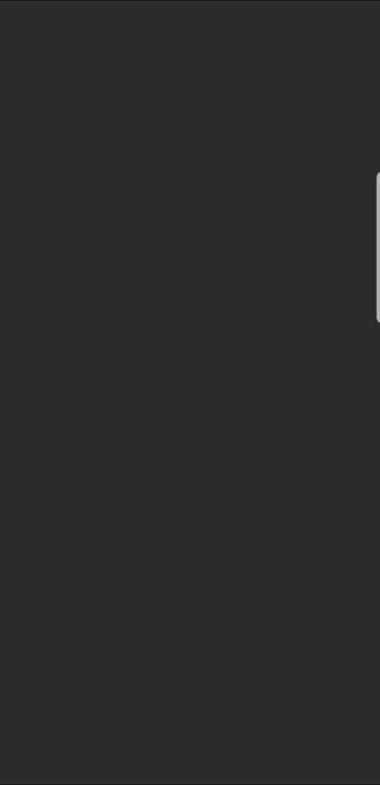
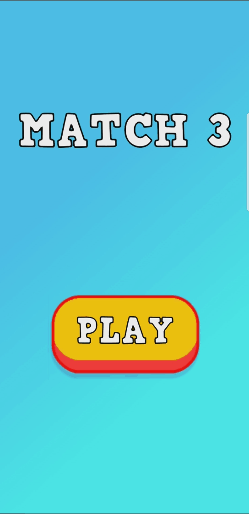
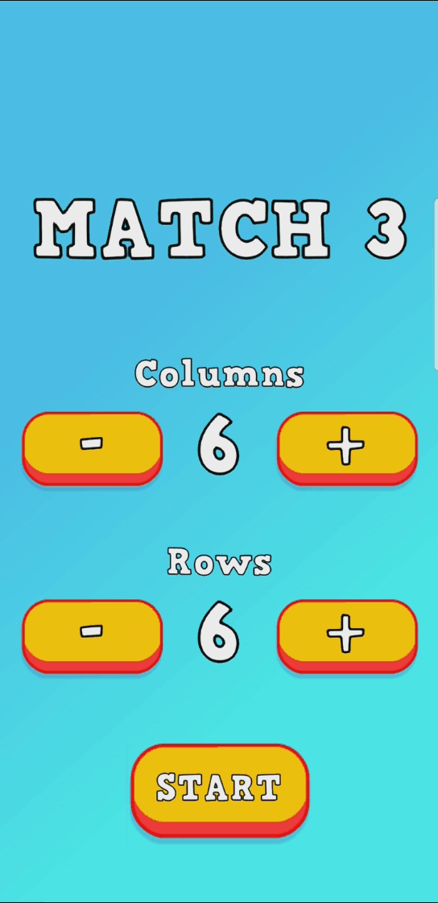
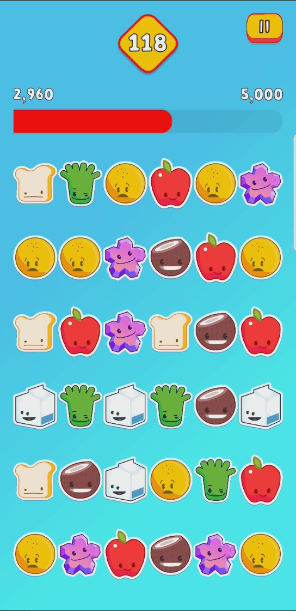
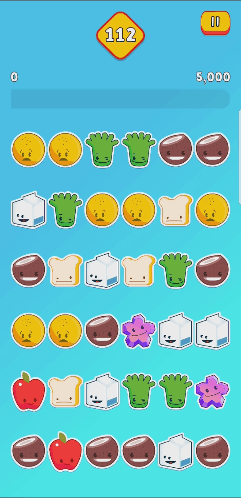
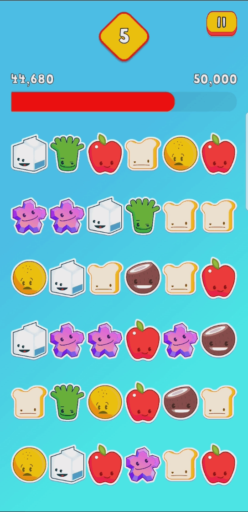
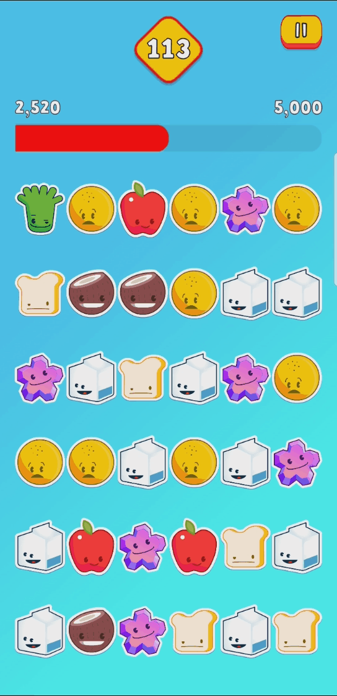

# 🕹️ Match 3

## 🧰 Technologies/Packages/Assets

- Unity 2019.3.11f1

  - [All Unity Versions](https://unity3d.com/get-unity/download/archive?_ga=2.102921411.299523596.1593798947-733524955.1584990359)
  - [2019.3.11f1 Release Notes](https://unity3d.com/unity/whats-new/2019.3.11)

- Texture Packer (Trial version)

  - [Download](https://www.codeandweb.com/texturepacker)
  - Texture Packer Importer: [Asset Store](https://assetstore.unity.com/packages/tools/sprite-management/texturepacker-importer-16641)

- DOTween (HOTween v2)

  - [Asset Store](https://assetstore.unity.com/packages/tools/animation/dotween-hotween-v2-27676)
  - [Documentation](http://dotween.demigiant.com/documentation.php)

- Text Mesh Pro (Package Manager)

- [Easy Buttons](https://github.com/madsbangh/EasyButtons)

- [Game Assets](https://github.com/PlayKids/match3-test)

## 🚀 Builds

- [1.0.0](Builds/Match3_v1.0.0.apk)

## 🎞️ Gameplay (Gifs)

#### Starting Game

  

#### Clicking on Play Button

  

#### Changing Grid Size

  

#### Clicking on Start Button

  

#### Swaping Gems

  

#### Clicking on Pause and Continue Buttons

  

#### Losing and Clicking on Restart Button

  

#### Clicking on Home Button

  

